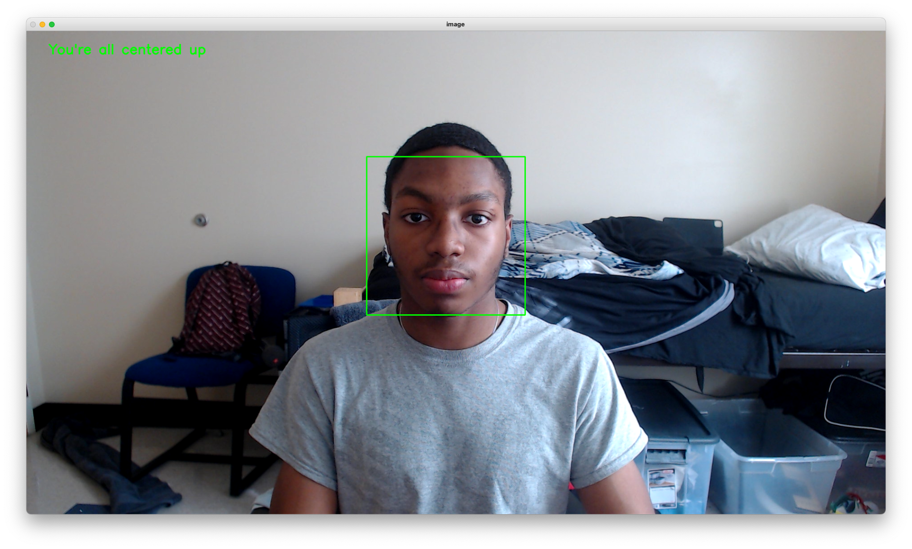
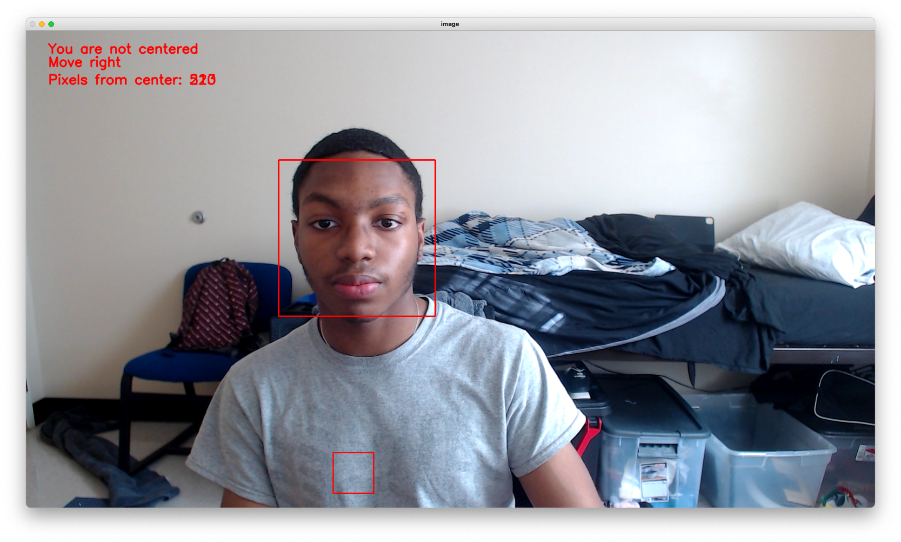
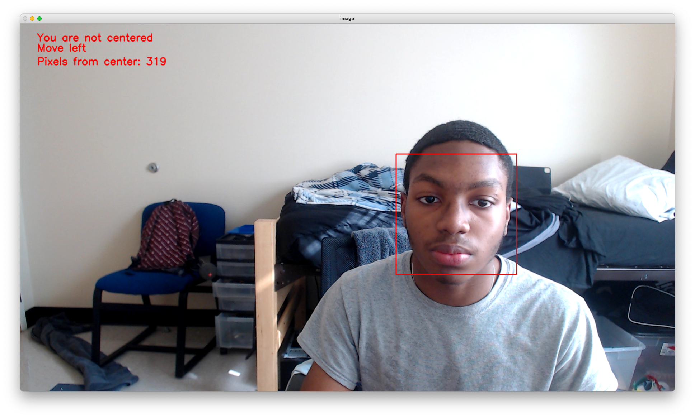

# Center Me
## This is a simple program that will tell the user which direction to move in order to be centered in the frame

### Usage
```
  python3 main.py
```
Centered                   | Not Centered
:---------------------------------:|:----------------:
 |  
